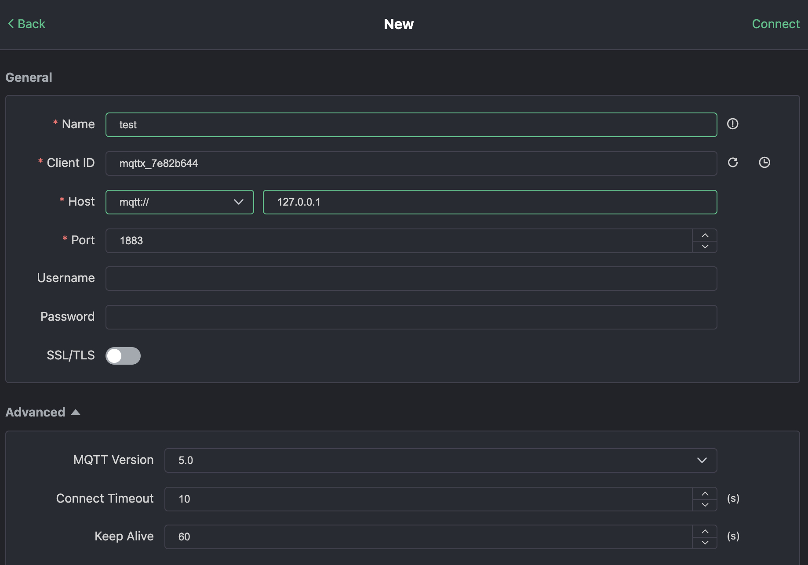
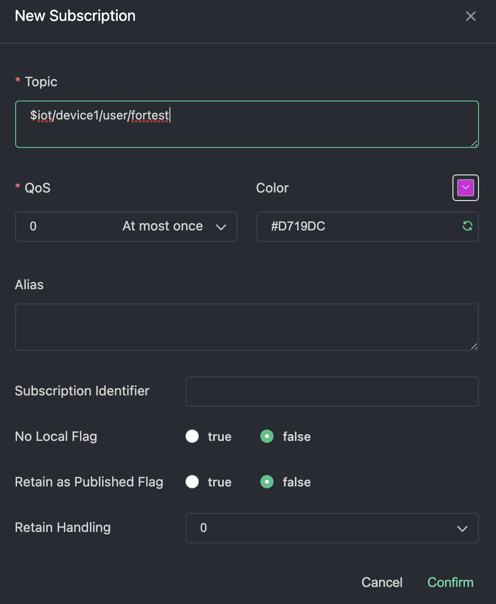
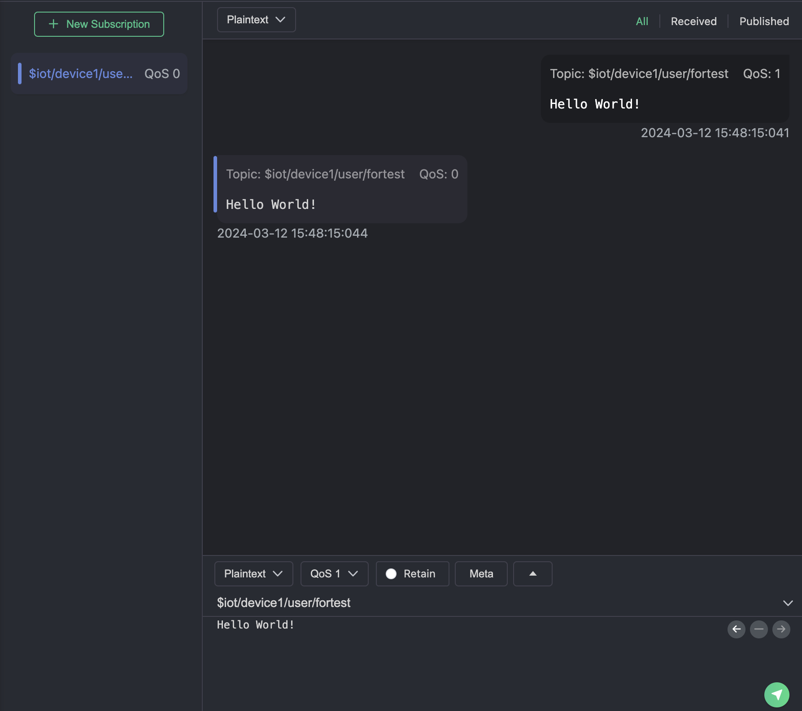

# Quick Install

For a rapid setup, Docker is recommended:

```bash
docker run -d --name bifromq -p 1883:1883 bifromq/bifromq:latest
```

For further installation alternatives and comprehensive details, refer to [Installation](../installation/intro.md).

# Quick Verify

Below are the steps to quickly verify the basic MQTT functionality of BifroMQ using MQTTX.

1. Visit https://mqttx.app/ to download MQTTX and install it.
2. Open MQTTX and click on **New Connection** (the “+” sign on the left sidebar) to create a new connection configuration.

   

3. Fill in the required fields:

   - **Name**: Any descriptive name of your choice.
   - **ClientID**: Can be set manually or generated randomly. Must consist of "a–z", "0–9", "\_", "-", ≤128 bytes, UTF8 encoded, and unique.
   - **Host**: The connection address, including protocol prefix:
     - `mqtt://<HOST>` for TCP
     - `mqtts://<HOST>` for TLS/SSL
     - `wss://<HOST>` for WebSocket Secure
   - **Port**: Select based on protocol:
     - TCP: `1883`
     - TLS/SSL: `1884`
     - WSS: `443`
   - **Username & Password**: Provide credentials if configured; otherwise leave blank for test environments.
   - **MQTT Version**: Choose from 3.1, 3.1.1, or 5.0.

4. After configuring, click **Connect** in the top right corner.
5. **Subscribe** to a topic: click **New Subscription**, enter the topic in the dialog, and confirm.

   

6. **Publish** a message: in the send/receive interface, enter the same topic, select QoS 0, type your message, and click **Send**.

   

7. You should see your published message appear in the interface.
