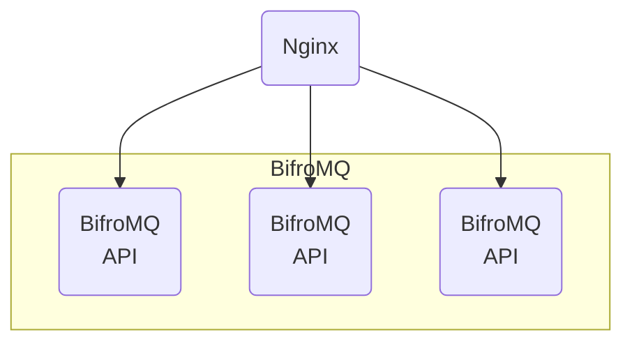

BifroMQ incorporates built-in API capabilities, allowing for operations such as disconnecting client connections, querying session status, publishing messages, and managing subscriptions. These features enable the integration of BifroMQ's management operations into custom management workflows.

## Deployment

By default, the API service functionality is automatically enabled on every BifroMQ service node using port 8091, For more setting options, refer to the [configuration file](../../admin_guide/configuration/config_file_manual.md). API requests can be sent to any node, ensuring high availability of the API capabilities in a standard deployment setup.

The diagram above illustrates a common deployment scenario: distributing API requests using a front-end load balancer, such as Nginx.
