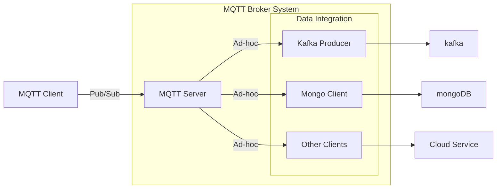
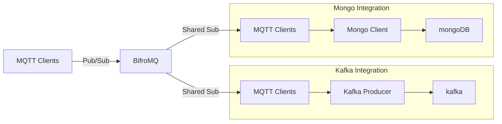

BifroMQ focuses on being deeply integrated, providing foundational MQTT capabilities for various messaging systems. This guide primarily introduces the recommended methods for data integration with BifroMQ.

## Understanding Data Integration with BifroMQ

Data integration with BifroMQ involves a bidirectional flow of messages between BifroMQ and external systems, including databases, rule-based message forwarding systems, other messaging middleware, or another MQTT Broker. This integration encompasses several key aspects:

- **Protocol Conversion**
- **Service Quality Matching**
- **Message Routing**
- **Flow Control**
- **Monitoring**
- **Scalability Considerations**

### Common Pattern

A common architectural pattern involves embedding downstream system clients directly within the MQTT Broker. This method utilizes specific communication mechanisms and mapping logic to achieve protocol conversion, treating the MQTT protocol implementation and integration with heterogeneous systems as a unified whole, providing out-of-the-box integration capabilities.

### Non-Coupled Pattern

Contrary to the common practice, BifroMQ recommends a non-coupled approach for data integration: Integration logic directly utilizes the MQTT protocol as a client to subscribe to messages from BifroMQ. This architectural pattern allows the integration module to be reused across different MQTT Brokers, hence the BifroMQ project itself does not include out-of-the-box data integration functionalities.

## Directions of Message Flow Integration

There are two primary directions for message flow integration with BifroMQ:

### From BifroMQ to External Systems

BifroMQ recommends using the [shared subscription](../basic/shared_sub.md) feature to balance the message load sent to downstream systems, utilizing MQTT's QoS capabilities for semantic message forwarding. This approach requires maintaining a set of MQTT client connections that subscribe to BifroMQ. Notably, BifroMQ supports shared subscriptions across MQTT versions 3.1, 3.1.1, and 5.0.

### From External Systems to BifroMQ

External systems can publish messages to BifroMQ using direct MQTT client connections or the [HTTP Restful API](../api/intro.md), providing a straightforward method for message injection into the BifroMQ deployment.

## Considerations for Implementing Data Integration

When integrating data with BifroMQ, consider the following:

- **Bandwidth Limitations**: BifroMQ defaults to a bandwidth limit of 512kb/s per MQTT connection, adjustable via Tenant Settings. Calculating the number of connections needed based on actual business demands when receiving messages forwarded through shared subscriptions is crucial.

- **Flow Control**: Using MQTT as the forwarding protocol inherently provides flow control. Downstream systems must have sufficient resources to receive forwarded messages to avoid backpressure-induced message loss.

- **Monitoring**: Thanks to the use of the MQTT protocol, the monitoring metrics provided by BifroMQ can be directly reused during the message forwarding phase, simplifying the integration monitoring process.

## Reference for Starters

This [project](https://github.com/bifromqio/bifromq-data-integration) showcases the concepts discussed in this guide and can serve as a reference for similar projects.
