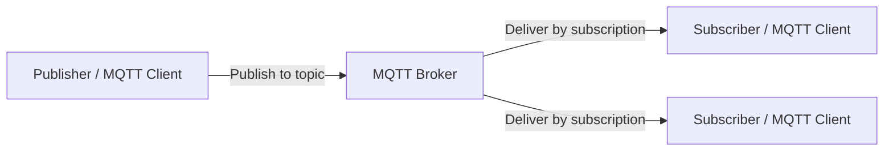

import Head from '@docusaurus/Head';
import CodeBlock from '@theme/CodeBlock';
import { releaseVersion } from '../../releaseInfo';

<Head>
  <link rel="canonical" href="https://bifromq.apache.org/mqtt/" />
  <script type="application/ld+json">
    {JSON.stringify({
      '@context': 'https://schema.org',
      '@type': 'TechArticle',
      headline: 'MQTT Protocol Guide for Apache BifroMQ',
      description:
        'Learn what MQTT is, how publish/subscribe messaging works, and how Apache BifroMQ implements MQTT for large-scale, multi-tenant IoT messaging.',
      url: 'https://bifromq.apache.org/mqtt/',
      author: {
        '@type': 'Organization',
        name: 'Apache BifroMQ',
        url: 'https://bifromq.apache.org/',
      },
      publisher: {
        '@type': 'Organization',
        name: 'Apache BifroMQ',
        url: 'https://bifromq.apache.org/',
      },
      mainEntity: [
        {
          '@type': 'Question',
          name: 'Is MQTT an Apache protocol?',
          acceptedAnswer: {
            '@type': 'Answer',
            text:
              'No. MQTT is an OASIS standard. Apache BifroMQ is an Apache Incubating project that implements MQTT broker capabilities for large-scale IoT messaging.',
          },
        },
        {
          '@type': 'Question',
          name: 'Which MQTT versions does Apache BifroMQ support?',
          acceptedAnswer: {
            '@type': 'Answer',
            text:
              'Apache BifroMQ supports MQTT 3.1, MQTT 3.1.1, and MQTT 5.0 over TCP, TLS, WS, and WSS.',
          },
        },
      ],
    })}
  </script>
</Head>

# MQTT Protocol Guide for Apache BifroMQ

MQTT is a lightweight publish/subscribe messaging protocol widely used for IoT, telemetry, and real-time messaging. This guide explains how MQTT works, why a broker sits at the center of every deployment, and how [Apache BifroMQ](/docs/get_started/intro/) delivers a production‑grade Apache MQTT broker implementation for large‑scale, multi‑tenant device connectivity.

For the official protocol documents, see the [MQTT Specification](https://mqtt.org/mqtt-specification/) page on MQTT.org.

## What is MQTT?

MQTT (originally Message Queuing Telemetry Transport) is a lightweight, publish/subscribe messaging protocol built for scenarios where clients need to exchange small messages efficiently over networks that may be unstable, bandwidth‑constrained, or latency‑sensitive.

Instead of communicating directly, MQTT clients route all messages through an MQTT broker. A client publishes a message to a topic, and the broker delivers it to every client that has subscribed to that topic. This decouples producers from consumers and makes MQTT a natural fit for environments with many devices, services, and applications.

Common use cases include:

- IoT device connectivity
- Industrial telemetry
- Smart city and smart energy systems
- Connected vehicles
- Mobile and edge messaging
- Real‑time device status reporting
- Multi‑tenant IoT platforms

MQTT is an OASIS standard. The official specifications—including MQTT 5.0 and MQTT 3.1.1—are maintained by the OASIS MQTT Technical Committee and linked from [MQTT.org](https://mqtt.org/mqtt-specification/).

## How MQTT Works

At a high level, MQTT relies on three core concepts: clients, brokers, and topics.



### MQTT Client

An MQTT client can be any device, application, gateway, backend service, or mobile app. A client may publish messages, subscribe to topics, or do both. Typical clients include sensors, industrial gateways, vehicle terminals, mobile apps, and cloud services that consume device telemetry.

### MQTT Broker

An MQTT broker is the server‑side component that accepts client connections, receives published messages, matches them against subscriptions, and delivers them to the right subscribers.

In production, a broker must handle much more than routing. It is often responsible for authentication, authorization, session state, retained messages, tenant‑level isolation, observability, throttling, and high availability.

[Apache BifroMQ](/docs/get_started/intro/) is purpose‑built for these demanding broker‑side workloads.

### MQTT Topics

MQTT topics are hierarchical strings used to route messages. For example:

```txt
factory/line-1/temperature
vehicles/truck-42/location
tenant-a/devices/device-001/status
```

Clients publish to topics, and subscribers receive messages from the topics they have subscribed to. Thoughtful topic design pays dividends in routing clarity, access control, observability, and downstream integration.

### Publish and Subscribe

MQTT uses a publish/subscribe communication model:

1. A subscriber connects to the broker and subscribes to one or more topics.
2. A publisher sends a message to a topic.
3. The broker delivers the message to all matching subscribers.

This approach lets publishers and subscribers evolve independently. Publishers never need to know which clients are listening, and subscribers never need to know which clients are publishing.

## MQTT Quality of Service

MQTT defines three Quality of Service (QoS) levels that describe how messages are delivered between clients and the broker.

| QoS Level | Meaning                | Typical use                                                    |
| --------- | ---------------------- | -------------------------------------------------------------- |
| QoS 0     | At most once delivery  | High‑frequency telemetry where occasional loss is acceptable   |
| QoS 1     | At least once delivery | Device status, commands, and events where delivery matters     |
| QoS 2     | Exactly once delivery  | Workloads that require stronger delivery guarantees            |

Choose the QoS level that matches your business requirement. Higher QoS provides stronger guarantees but also adds protocol overhead and state‑management cost.

## MQTT Sessions, Retained Messages, and Last Will

MQTT includes several features that make it practical for real device networks.

### Sessions

An MQTT session stores client‑related state—such as subscriptions and queued messages for offline delivery. Persistent sessions help when clients disconnect and reconnect frequently.

### Retained Messages

A retained message tells the broker to keep the latest message on a topic and deliver it immediately to new subscribers. This is ideal for status‑like data: the latest configuration, availability, or device state.

### Last Will and Testament

The Last Will and Testament feature lets a client define a message that the broker will publish if the client disconnects unexpectedly. It is commonly used for device presence and online/offline status.

## Why MQTT is Used for IoT Messaging

MQTT is often the protocol of choice for IoT and device messaging because it is simple at the wire level yet flexible enough for diverse deployment patterns.

Key advantages include:

* **Lightweight protocol overhead** – works well on constrained devices and bandwidth‑sensitive links.
* **Bi‑directional messaging** – devices and backend systems can both publish and subscribe.
* **Decoupled architecture** – publishers and subscribers do not need direct knowledge of each other.
* **Flexible delivery guarantees** – QoS levels let you pick the right trade‑off for each workload.
* **Resilience on unstable networks** – sessions and reconnect behavior help with intermittently connected devices.
* **Topic‑based routing** – hierarchical topics make it easy to model devices, tenants, regions, and workloads.

For large‑scale IoT platforms, protocol support alone is not enough. The broker architecture becomes critical.

## What is an MQTT Broker?

An MQTT broker is the central message routing component in an MQTT system. It receives messages from publishers and delivers them to subscribers based on topic subscriptions.

A production‑grade broker may need to handle:

* Large numbers of concurrent client connections
* Topic matching and message routing
* Authentication and authorization
* Session persistence
* Retained messages
* Tenant‑level resource isolation
* Traffic throttling
* Metrics and operational events
* Cluster deployment and high availability
* Integration with downstream systems

MQTT defines the protocol behaviour; the broker implementation determines how well the system performs under real‑world loads. This is where Apache BifroMQ excels.

## Running MQTT at Scale with Apache BifroMQ

[Apache BifroMQ](/docs/get_started/intro/) is a Java‑based, high‑performance, distributed MQTT broker with native multi‑tenancy support. It is designed for platforms that need to manage large numbers of IoT device connections reliably.

BifroMQ is especially relevant when you need an Apache MQTT broker implementation for production workloads that involve many devices, multiple tenants, and strict workload isolation.

### MQTT Version Support

Apache BifroMQ supports MQTT 3.1, MQTT 3.1.1, and MQTT 5.0 over TCP, TLS, WS, and WSS. This makes it suitable for environments where legacy MQTT 3.x clients and newer MQTT 5.0 clients coexist.

### Native Multi‑Tenancy

BifroMQ includes native support for multi‑tenancy, resource sharing, and workload isolation. This is valuable for IoT platforms that serve multiple customers, business units, regions, or device fleets on shared infrastructure.

### Built‑in Storage for MQTT Workloads

BifroMQ embeds a distributed storage engine optimized for MQTT workloads, so you do not need third‑party middleware for core broker state. This simplifies the architecture when managing session state and retained messages at scale.

### Extension Mechanism

BifroMQ provides extension points for broker‑side integration, including:

* Authentication and authorization
* Tenant‑level client balancing
* Tenant‑level resource throttling
* Tenant‑level runtime settings
* Event collection and monitoring

For details, start with the [BifroMQ introduction](/docs/get_started/intro/) and the [FAQ](/docs/get_started/faq/).

## MQTT Versions and Official Specifications

The MQTT specifications are available from MQTT.org:

| MQTT version | Notes                                                      | Specification                                                    |
| ------------ | ---------------------------------------------------------- | ---------------------------------------------------------------- |
| MQTT 5.0     | Current major version with richer protocol features        | [MQTT 5.0 Specification](https://mqtt.org/mqtt-specification/)   |
| MQTT 3.1.1   | Widely deployed version and an older ISO / OASIS standard  | [MQTT 3.1.1 Specification](https://mqtt.org/mqtt-specification/) |
| MQTT 3.1     | Historical reference                                       | [MQTT 3.1 Specification](https://mqtt.org/mqtt-specification/)   |

For new systems, MQTT 5.0 is worth evaluating. For compatibility with existing devices, MQTT 3.1.1 remains common in production IoT deployments.

## Get Started with MQTT on Apache BifroMQ

You can start Apache BifroMQ quickly with Docker:

<CodeBlock language="bash">
{`docker run -d --name bifromq -p 1883:1883 apache/bifromq:${releaseVersion}`}
</CodeBlock>

Once the broker is running, verify basic MQTT functionality by connecting with any MQTT client, subscribing to a topic, and publishing a message to that topic.

Useful next steps:

* [Quick Install & Verify](/docs/get_started/quick_install/)
* [Docker installation](/docs/installation/docker/)
* [BifroMQ introduction](/docs/get_started/intro/)
* [Frequently Asked Questions](/docs/get_started/faq/)

## MQTT Use Cases for BifroMQ

Apache BifroMQ is a strong fit for MQTT workloads where scale, isolation, and broker‑side architecture matter.

### Large‑Scale IoT Connectivity

Use BifroMQ when a platform needs to maintain many concurrent MQTT connections and route device messages efficiently.

### Industrial Telemetry

Industrial environments often generate high‑volume telemetry from sensors, machines, and gateways. MQTT provides a lightweight messaging layer; BifroMQ adds broker‑side scalability.

### Connected Vehicle Messaging

Vehicles and mobile assets connect and disconnect frequently. MQTT sessions, topic‑based routing, and robust connection management are particularly valuable for these workloads.

### Multi‑Tenant IoT Platforms

When multiple tenants share the same messaging infrastructure, resource control and isolation become essential. BifroMQ is designed with native multi‑tenancy in mind.

### Real‑Time Device Status

MQTT retained messages and Last Will messages can represent online/offline status, latest state, and availability information for connected devices.

## MQTT FAQ

### Is MQTT an Apache protocol?

No. MQTT is an OASIS standard. Apache BifroMQ is an Apache Incubating project that implements MQTT broker capabilities. The phrase “Apache MQTT broker” typically refers to an MQTT broker implementation in the Apache ecosystem, not to a separate Apache‑owned MQTT protocol.

### What is an MQTT broker?

An MQTT broker is the server‑side component that accepts MQTT client connections, receives published messages, matches topics, and delivers messages to subscribers.

### Which MQTT versions does Apache BifroMQ support?

Apache BifroMQ supports MQTT 3.1, MQTT 3.1.1, and MQTT 5.0.

### Does Apache BifroMQ support MQTT over WebSocket?

Yes. BifroMQ supports MQTT over TCP, TLS, WS, and WSS.

### Is BifroMQ only for IoT?

No. MQTT is most commonly associated with IoT, but the publish/subscribe model is also useful for instant messaging, device status, telemetry, and other real‑time messaging scenarios.

### Does BifroMQ include a built‑in rule engine?

No. BifroMQ focuses on implementing standard MQTT broker capabilities. Rule engines are not part of the MQTT protocol and can be implemented externally through integrations.

### When should I choose a distributed MQTT broker?

A distributed MQTT broker becomes important when you need to support a large number of concurrent clients, isolate workloads across tenants, scale horizontally, or build a production‑grade IoT messaging platform.

## Related Resources

* [Apache BifroMQ introduction](/docs/get_started/intro/)
* [Quick Install & Verify](/docs/get_started/quick_install/)
* [Docker installation](/docs/installation/docker/)
* [BifroMQ FAQ](/docs/get_started/faq/)
* [Download Apache BifroMQ](/download/)
* [MQTT Specification](https://mqtt.org/mqtt-specification/)
* [MQTT Software](https://mqtt.org/software/)
